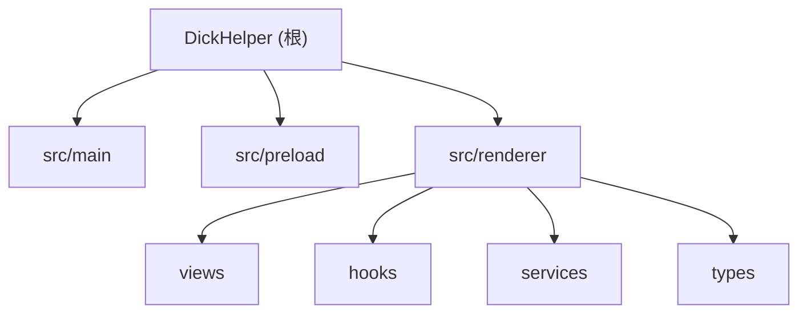

# DickHelper -- 项目总览

> 牛子小助手：一个基于 Electron + React + TypeScript 的跨平台桌面应用，用于科学记录和统计个人生活数据。

## 项目愿景

提供一个简洁、隐私优先的本地桌面工具，帮助用户记录、统计和管理个人打飞机数据。所有数据完全存储在本地 SQLite 数据库中，不上传任何服务器。

## 架构总览

三层 Electron 架构，通过 IPC 通道进行进程间通信：

| 层 | 位置 | 职责 |
|---|---|---|
| Main（主进程） | `src/main/` | SQLite 持久化、IPC 处理、窗口/托盘管理 |
| Preload（预加载） | `src/preload/` | 安全边界，通过 `contextBridge` 暴露白名单 API |
| Renderer（渲染进程） | `src/renderer/` | React UI、视图切换、数据展示 |

数据流方向：`Renderer --> (IPC invoke) --> Main --> SQLite --> (IPC reply) --> Renderer`

## 模块结构图



## 模块索引

| 模块 | 路径 | 语言 | 职责概述 |
|------|------|------|---------|
| Main | `src/main/` | TypeScript | Electron 主进程：窗口创建、系统托盘、IPC 注册、SQLite 数据库 |
| Preload | `src/preload/` | TypeScript | 安全沙箱桥接层，暴露 `window.electronAPI` |
| Renderer | `src/renderer/` | TypeScript/TSX | React UI 层：视图、Hooks、服务封装、类型定义 |

## 运行与开发

### 前置要求

- Node.js >= 18
- npm >= 9

### 常用命令

```bash
npm install          # 安装依赖
npm run dev          # 启动开发模式（Vite dev server + Electron 热重载）
npm run build        # 构建生产版本（输出到 out/）
npm run preview      # 预览构建结果
npx tsc -b --noEmit  # 类型检查
```

### 构建与打包

- 构建工具：`electron-vite` + `Vite 6`
- 打包工具：`electron-builder`（配置见 `electron-builder.yml`）
- 构建产物：`out/main/`、`out/preload/`、`out/renderer/`
- 分发产物：`dist/`（exe/dmg/AppImage）

### CI/CD

GitHub Actions 工作流 `.github/workflows/release.yml`：
- 触发条件：推送 `v*.*.*` 标签 / 发布 Release / 手动触发
- 三平台并行构建（Windows/macOS/Linux）
- 自动上传到 GitHub Release

## 技术栈

| 组件 | 选型 |
|------|------|
| 桌面框架 | Electron 35 |
| UI 框架 | React 19.1 |
| 语言 | TypeScript 5.7（strict 模式） |
| 构建 | electron-vite + Vite 6 |
| 组件库 | Mantine 7 |
| 图标库 | @tabler/icons-react |
| 数据库 | SQLite（sql.js WASM） |
| 路由 | 无路由库，useState 视图切换 |
| 状态管理 | SQLite + React 本地状态（无全局状态库） |

## 测试策略

当前项目**没有测试文件**。无单元测试、集成测试或端到端测试。类型检查（`tsc -b --noEmit`）是唯一的静态验证手段。

## 编码规范

- **命名风格**：C# / .NET 风格 PascalCase
  - 组件：`RecordForm`、`StatsChart`
  - 服务方法：`DatabaseService.GetRecords()`
  - Hooks：`useRecords`、`useTimer`（React 惯例）
  - 接口：`I` 前缀（`IRecord`、`IStats`）
- **TypeScript**：strict 模式启用全部严格检查（`noUnusedLocals`、`noUncheckedIndexedAccess` 等）
- **注释语言**：代码注释使用中文，文档使用中英双语
- **架构约束**：Main 进程代码不得导入 Renderer（反之亦然），通过 IPC 通信

## AI 使用指引

- 本项目是 **Electron 桌面应用**，不是 Flutter/Dart 项目
- 数据层在 Main 进程（`src/main/database.ts`），UI 层在 Renderer（`src/renderer/`）
- 修改数据操作需同时更新：Main IPC handler、Preload 桥接、Renderer DatabaseService、类型定义
- 新增视图放 `src/renderer/views/`，新增 Hook 放 `src/renderer/hooks/`
- 数据访问逻辑放 `src/renderer/services/`，不要写在组件里
- 日期在 IPC 传输时使用 ISO 8601 字符串，Renderer 侧转为 `Date` 对象
- 项目使用 `.trellis/` 目录管理开发规范（见 `.trellis/spec/`），该目录标记为 `linguist-vendored`

## 关键文件速查

| 文件 | 用途 |
|------|------|
| `src/main/index.ts` | 应用入口：窗口创建、托盘、IPC 注册 |
| `src/main/database.ts` | SQLite 数据库服务（CRUD + 统计 + 导入） |
| `src/preload/index.ts` | contextBridge 暴露 electronAPI |
| `src/preload/index.d.ts` | electronAPI 类型声明 |
| `src/renderer/App.tsx` | React 根组件：MantineProvider + AppShell + 视图切换 |
| `src/renderer/services/DatabaseService.ts` | Renderer 侧 IPC 调用封装 + 导入导出 |
| `src/renderer/hooks/useTimer.ts` | 计时器逻辑（开始/暂停/继续/停止） |
| `src/renderer/hooks/useRecords.ts` | 记录数据加载 + IPC 事件监听自动刷新 |
| `electron.vite.config.ts` | electron-vite 构建配置 |
| `electron-builder.yml` | 打包配置（appId: com.york.dickhelper） |
| `.github/workflows/release.yml` | 三平台 CI/CD 发布流水线 |

## 变更记录 (Changelog)

| 时间 | 操作 | 说明 |
|------|------|------|
| 2026-05-24 00:43:49 | 初始生成 | 首次全量扫描，生成根级 + 模块级 CLAUDE.md 及 index.json |

# 每次修改完commit

每次修改完需要对自己修改的部分commit